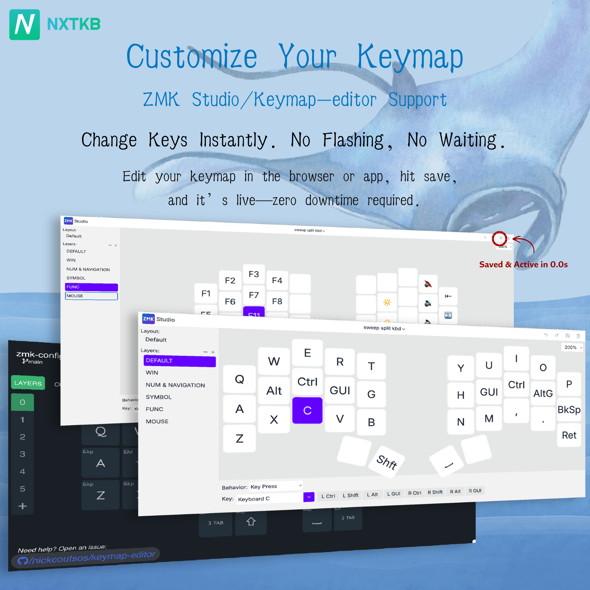
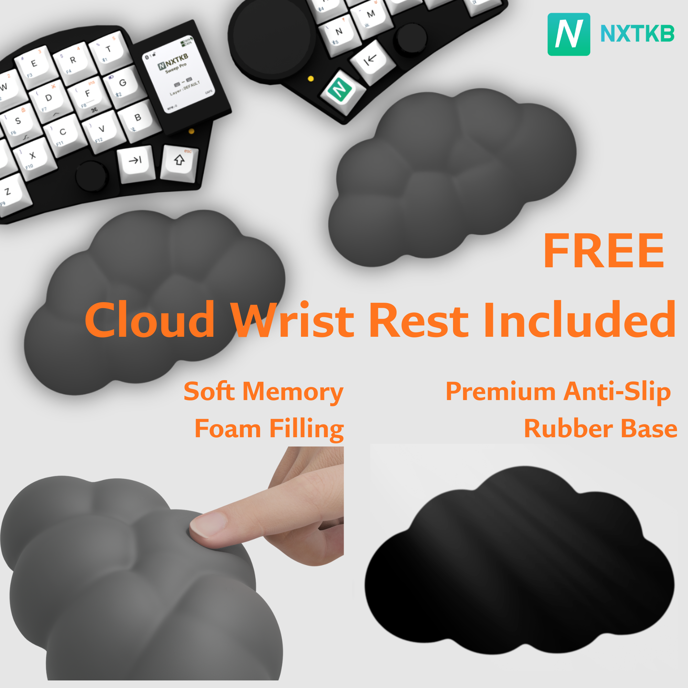
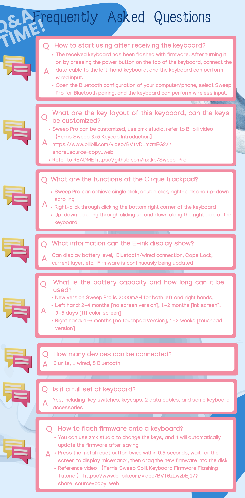
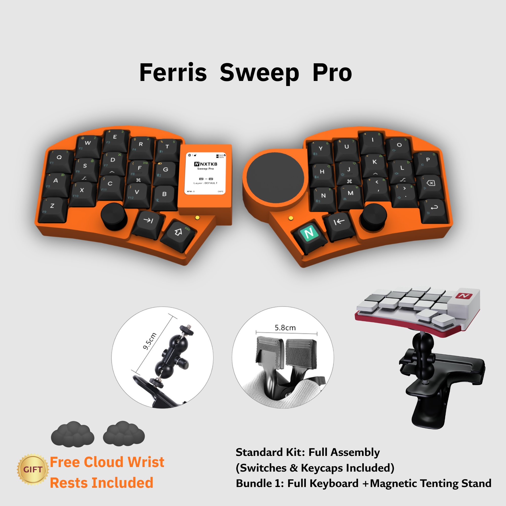



A high-performance, ultra-thin split ergonomic keyboard designed for enthusiasts and power users.

Featuring ZMK Studio support, magnetic tenting, and a premium low-profile aesthetic.

<a class="btn btn-lg btn-primary me-3 mb-4" href="https://item.taobao.com/item.htm?ft=t&id=1021093959607" target="_blank">
  Shop Now <i class="fas fa-shopping-cart ms-2"></i>
</a>
<a class="btn btn-lg btn-secondary me-3 mb-4" href="">
  Documentation <i class="fas fa-book ms-2"></i>
</a>



{}

Engineered for programmers and keyboard enthusiasts — E-ink status display, integrated Cirque trackpad, dual rotary encoders, and 4000mAh battery capacity. All in an ultra-thin, wireless split design.

{}

<!-- Key Features -->
{}

{}
1.54" high-contrast E-ink screen showing battery, layers, pairing status, and connection mode in real time.
{}

{}
Integrated 40mm Cirque GlidePoint&reg; circle trackpad with gesture recognition — no mouse needed.
{}

{}
Twin rotary encoders for volume control, page scrolling, or custom macro execution.
{}

{}

{}

{}
2000mAh per side for months of wireless usage on a single charge.
{}

{}
Real-time key remapping with no coding or reflashing required.
{}

{}
Rapidly adjust your typing angle with our specialized magnetic stands.
{}

{}

<!-- Technical Specifications -->

## Technical Specifications

| Component | Specification |
|:--|:--|
| **Layout** | 34 Keys (Ferris Sweep Variant) |
| **Display** | 1.54" E-ink Display (High-contrast Electronic Paper) |
| **Pointing Device** | Cirque GlidePoint&reg; Circle Trackpad |
| **Input** | Dual Clickable Rotary Encoders |
| **Firmware** | ZMK Firmware (Studio Compatible) |
| **Keycaps** | Custom-Designed for Sweep Pro (Sculpted Low-Profile PBT) |
| **Switches** | 4 Low-Profile Options: Kailh Silent Linear, Kailh Silent Tactile, Kailh Clicky White, Gateron Low Profile Blue |
| **Battery** | 4000mAh Total (Dual 2000mAh Li-ion) |
| **Connectivity** | Bluetooth + USB-C |

<!-- Cirque Trackpad -->

## Cirque GlidePoint&reg; Trackpad

The 40mm Cirque Trackpad comes with built-in gesture recognition, allowing you to perform common mouse actions directly on the keyboard:

- **Cursor Move** — Slide with one finger
- **Left Click** — Single tap anywhere on the pad
- **Double Click** — Double tap to open files or select text
- **Right Click** — Tap the lower-right corner for context menus
- **Vertical Scroll** — Slide one finger up or down along the right edge

<!-- E-ink Display -->

## 1.54" High-Contrast E-ink Display

Unlike traditional OLED screens that can be distracting or power-hungry, our E-ink Electronic Paper Display provides an elegant, always-on status hub.

- **Real-Time Status** — View active layers, battery percentage, and connection mode (USB/Bluetooth)
- **Split Sync Info** — Exclusive status indicators for left/right pairing and synchronization health
- **Ultra-Low Power** — Only draws power when the display content changes
- **Perfect Visibility** — Crystal clear readability even under direct sunlight

<!-- Keycaps -->

## Custom-Designed Sweep Pro Keycaps

Bespoke low-profile PBT keycaps engineered specifically for this 34-key layout.

- **Premium PBT Material** — Textured, non-slip feel that resists oil and shine even after years of heavy typing
- **5-Sided Dye-Sublimation** — Vibrant, permanent legends that wrap around the edges
- **Sculpted for Ergonomics** — Optimized height and curvature to minimize finger travel
- **Intuitive Sub-Layer Legends** — Front-printed legends for secondary layers, making it effortless to navigate symbols and macros

<!-- Switch Options -->

## Low-Profile Switch Options

Choose the perfect tactile experience for your workflow. We offer four premium low-profile switch options.

| Switch Type | Feel | Sound Level | Best For... |
|:--|:--|:--|:--|
| **Kailh Silent Linear** | Smooth, consistent travel | Ultra-Quiet | Open offices, late-night sessions |
| **Kailh Silent Tactile** | Soft bump at actuation | Ultra-Quiet | Feedback without the noise |
| **Kailh Clicky White** | Sharp, crisp tactile bump | Satisfying Click | Classic mechanical "click" lovers |
| **Gateron Low Blue** | Classic tactile click | Moderate Click | Balanced, traditional clicky experience |

> **Tip:** For shared workspaces, we recommend the **Kailh Silent** series to maintain a quiet environment.

<!-- ZMK Studio -->

## ZMK Studio Support

- **Real-Time Remapping** — Change any key or macro on the fly
- **Instant Effect** — Click "Save" and your new keymap is active immediately — no reboots, no flashing, zero downtime

<!-- Professional Details -->

## More Professional Details

We've obsessively refined the Ferris Sweep Pro to ensure every interaction feels premium and intentional.

### Dual Rotary Encoders

Precision-machined dual encoders offer tactile scrolling at your fingertips. Fully customizable via ZMK:
- **Left Encoder** — Quick Volume Control & Mute
- **Right Encoder** — Screen Brightness or Page Scrolling
- **Customizable** — Map to Zoom, Undo/Redo, or brush size in creative apps

### Dedicated Metal Reset Button

No more fumbling with paperclips or shorting pins.
- **Hardware-Level Control** — A robust metal button for quick system resets
- **Bootloader Mode** — Double-click within 0.5s to enter firmware update mode

### Ergonomic Stepped Thumb Cluster

A **sunken stepped design** that matches the natural resting curve of your thumb — making layer switching more intuitive and reducing fatigue.

<!-- Versions & Bundles -->

## Version & Bundle Options

### Choose Your Version

<h4>Basic Edition</h4>

Full keyboard assembly with switches & keycaps included.

<h4>E-ink Edition</h4>

Basic Edition + 1.54" E-ink Status Display.

<h4>Trackpad Edition</h4>

Basic Edition + Cirque GlidePoint&reg; Trackpad.

<h4>Flagship Edition</h4>

The ultimate setup with both E-ink Display & Cirque Trackpad.

### Choose Your Bundle

- **Standard Kit** — Your chosen keyboard version only.
- **Ergo Pack (Bundle 1)** — Chosen keyboard version + Magnetic Tenting Stands.

<h4>Exclusive Bonus</h4>

Every order includes a pair of Cloud Memory Foam Wrist Rests as a free gift.

<!-- Default Layout -->

## Default Layout

Our default 34-key layout is designed for maximum efficiency with minimal finger travel.

<!-- Q&A -->

## Q&A

<!-- Color Options -->

## More Color Options

<!-- Support -->
{}

<h2>Support & Links</h2>

<i class="fas fa-store"></i>
<strong>Taobao:</strong> Search "ferris sweep" or <a href="https://item.taobao.com/item.htm?ft=t&id=1021093959607" target="_blank" style="color: #fff; text-decoration: underline;">click here</a>

<i class="fab fa-discord"></i>
<strong>Discord:</strong> @lilin0522

<i class="fab fa-weixin"></i>
<strong>WeChat:</strong> nxtkb888 / 1736465973

{}
